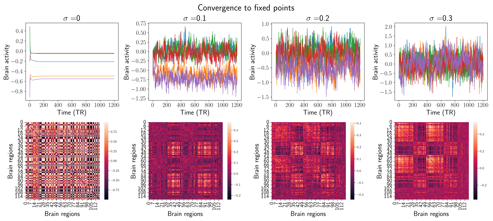
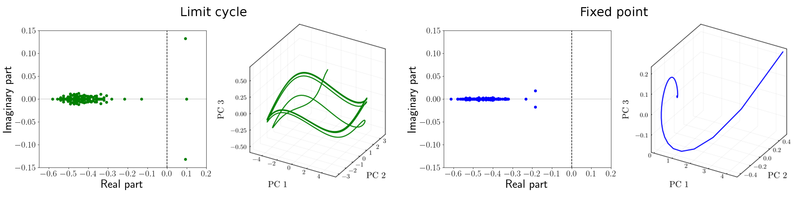
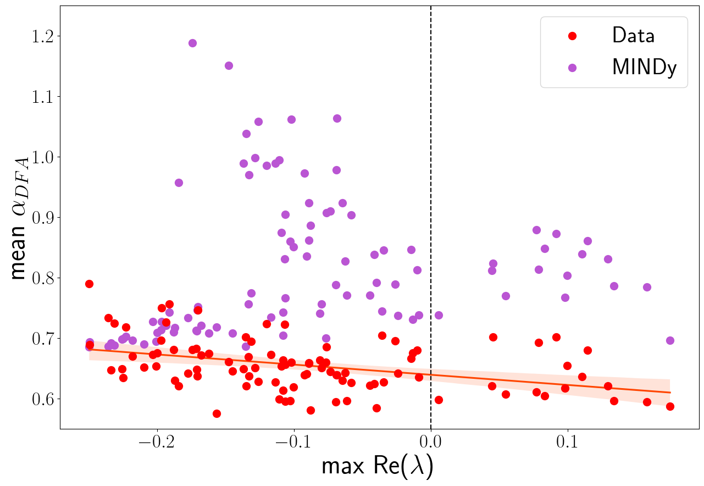

# Dynamic Functional Connectivity Analysis
## About the thesis
This is the GitHub repository of my Bachelor Thesis in Physics.  
Understanding brain activity, even during the resting state, is an open challenge in neuroscience due to the system's complexity. In this work, we studied whether and how a particular generative causal model (called MINDy) can reproduce a scalar feature of the time series from functional magnetic resonance imaging, the global dynamic functional connectivity speed.

## About the repository
The repository is organized into different files:
* <code>functions.py</code>: definitions of all the main functions used in the analysis.
* <code>notebook.ipynb</code>: Jupyter Notebook (10.3 MB) with the experiments and the analyses. It's organized itself into sections and subsections to be more readable. The variables whose calculation is particularly long are saved into the <code>files</code> directory.
* <code>training.m</code>: MATLAB simple pipeline to call the fitting function and save the obtained parameters into the <code>MINDy_parameters</code> directory.
* <code>sigma_plots.jl</code> does few more plots made in Julia.

## Gallery

    
  <em>Figure 1.1: Comparison between static and dynamic functional connectivity matrices. On the left, the static case is obtained from the full scan time series. On the right, the dFC stream from the SWC analysis.</em>

 

 

    
  <em>Figure 3.1: Global speed dependence on $\tau$. On the left, every boxplot shows the first quartile, third quartile, median, and flier points of the $V_{dFC}$ distribution for a given $\tau$ in a single subject. On the right, the heights of the corresponding normalized kernel density estimations provide a graphical visualization of the relationship between the mean and the standard deviation of every speed distribution.</em>

 

 

  
    
  <em>Figure 3.3: Comparison of the two behaviors in terms of simulated BOLD signals and static FC. Each column shows examples of the results of the MINDy model integration for a given $\sigma_\varepsilon$. The showed signals are just $5$ random time series from the $119$ available.</em>

 

 

    
  <em>Figure 3.4: Full session FC and sigma. On the left, for each subject, the correlation between the FC obtained from the data and the simulated one as a function of the $\sigma_\varepsilon$. It is a measure of model performance. On the right, the violin plot of the correlation for $\sigma_\varepsilon=0.2$ for both behaviors: limit cycle (green) and fixed point (blue).</em>

 

 

    
  <em>Figure 3.6: Comparison of the two behaviors in terms of eigenvalues $\lambda$ of the linearized system around the corresponding equilibrium, and phase portrait of the two behaviors. For both classes of behavior, we show examples of the set of eigenvalues and the projection of the simulated time series onto the first 3 principal components. In the case of a limit cycle, periodic orbits link neighborhoods of two unstable fixed points. Otherwise, the systems converge to a single point.</em>

 

 

    
  <em>Figure 3.8: Comparison between the distributions (kernel density estimations) obtained by MINDy and the experimental one. The simulations were computed with $\sigma_\varepsilon=0.2$.</em>

 

 

    
  <em>Figure 3.9: For each range, two-sided Kolmogorov–Smirnov distances between the actual dFC speed distributions and the ones obtained by MINDy. The distances, treated as a function of the noise magnitude $\sigma_\varepsilon$, provide information about the model performances. This plot also highlights the differences between the two behaviors: convergence to a limit cycle (green) and to a fixed point (blue).</em>

 

 

  
   
   
  <em>Figure 3.11: On the left, the relationship between the self-correlation ($\alpha_{DFA}$) and the obtained MINDy non-linearity ($\alpha_{MINDy}$). Each dot corresponds to a single subject and reports the average $\alpha_{DFA}$ and \alpha_{MINDy}$ from the $119$ experimental and surrogate time series, respectively. The plot shows also the distributions of these two features, both for the fixed point and limit cycle classes. On the right, the relationship between the obtained max (real part) eigenvalues of the linearized systems and $\alpha_{DFA}$, both computed for the actual and simulated time series. The differences between red and purple dots are a measure of the performances of the model ($\sigma_\varepsilon=0.2$) in reproducing the corrected $\alpha_{DFA}$.</em>

 

